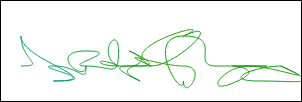
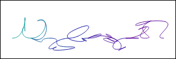
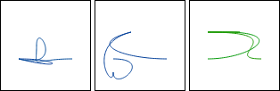

# KeyVis #

## What is it? ##

This Javascript library is a single function which takes some kind of binary data,
generally a digital fingerprint or hash, and creates a written signature like visualization
on an HTML5 canvas.

Use markup like:  
`<canvas width="300" height="100" data-key="fPsAuguXafE2/E/U85YZiYvR2d2FpX88CtGbir+Xdls="></canvas>`  
and call:  
`KeyVis.drawOn(theElement);`  
which generates the image below.

## Why? ##

Even if you know what digital keys and signatures are,
*7CFB00BA0B9769F136FC4FD4F39619898BD1D9DD85A57F3C0AD19B8ABF97765B*
doesn't really mean anything to anyone. You can't even really
remember or compare this to another fingerprint unless they're side by side.
On the other hand, the image below is something you would be able to recognize.

Yes, it still needs to be verified digitally, but this gives something to the user
that says this is secured by this key, and it makes it a lot more intuitive.

My hope is that something like this will be used for something like pgp signing
of emails or displayed somewhere for https.

## How? ##

Every 32 bits creates 1 "character", which starts at the baseline, curves
into 2 (16 bit) points and back to the baseline.  In those 16 bits I break
out some info like x,y, color change, and approach. Below is what some crc32
hashes turn into.

## Plans ##

* Add dark theme.
* Add some style elements to the entire signature like slant.
* Find some decription functions instead of atob, especially for hex.
* Maybe smooth it out somehow so it's more like handwriting.

------------------

Created by Ken Michalak.
